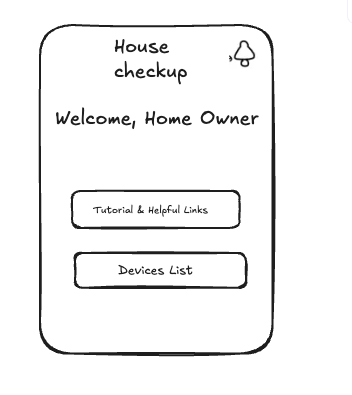
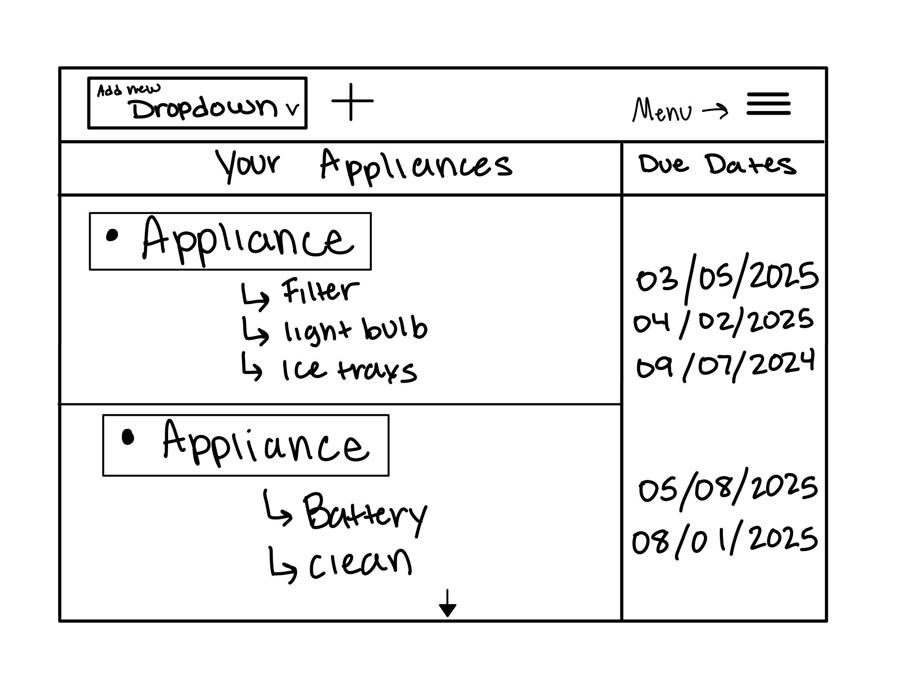
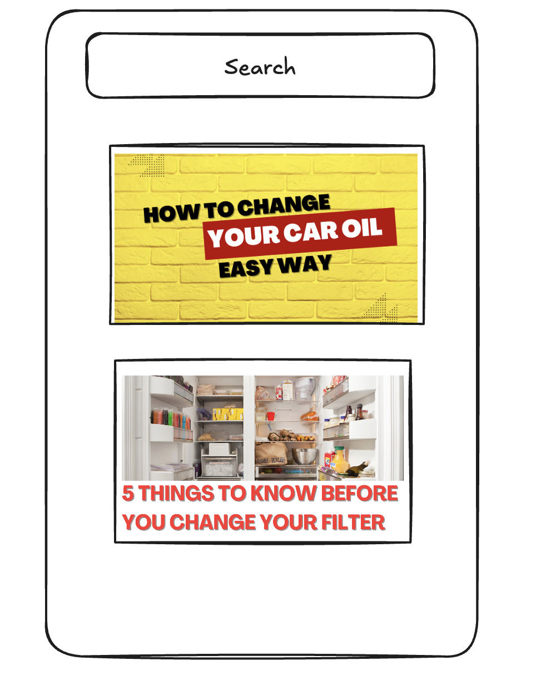

# Wireframes

## Home Page 

When the user logs in, they will see the first page of the House Checkup app. Here, they can choose to view a tutorial or see a list of devices they own. The app also includes an alert for reminders, so users will be notified about any upcoming maintenance tasks or important updates for their appliances. This makes it easy for homeowners to stay on top of their appliance management and maintenance.  

## Appliances Page 

This is the primary functional page of the application. Users will be able to add new appliances, update their features, date of last repair and see the due dates of new repairs. The page can scroll down if there are too many appliances on it. This page will also include a menu for users to route to pages they need or desire depending on the pages we decide to implement in the future.  

## Tutorials and Heplful Links

This page is full of information on learning the appliances in one's home and how to replace/repair the necessities. With primarily the use of video tutorials.  

